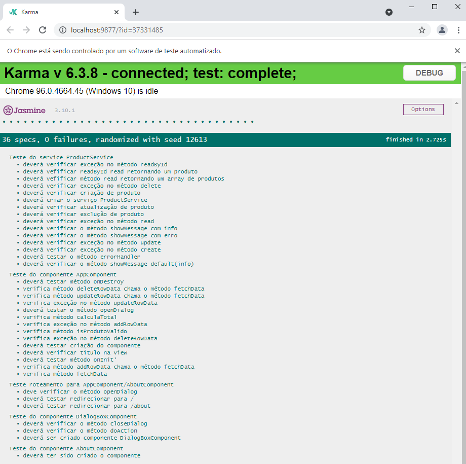
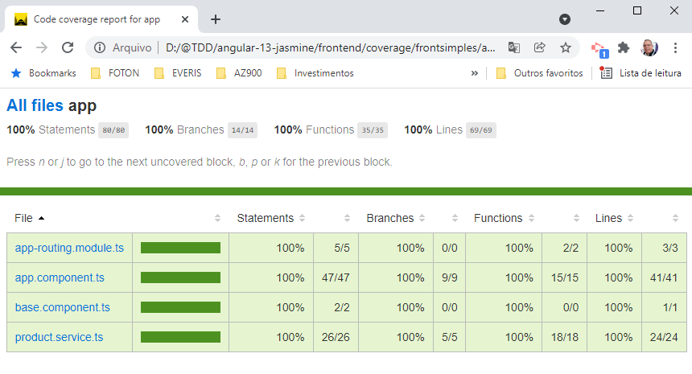

# Workshop - Angular Testes com Jasmine e Karma

Aplicação web utilizando framework Angular e JSON Server para registro de produtos, com os comandos de um CRUD: criar, ler, atualizar e deletar

## Projeto Final

```bash
npm run test:cover
```

### Karma



### Coverage




## Github

https://github.com/lyndontavares/angular-13-jasmine
