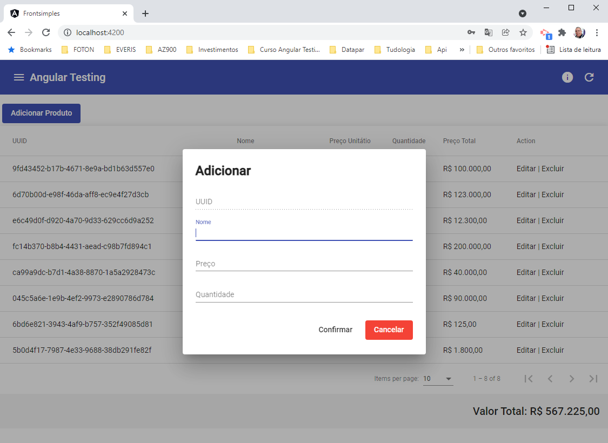
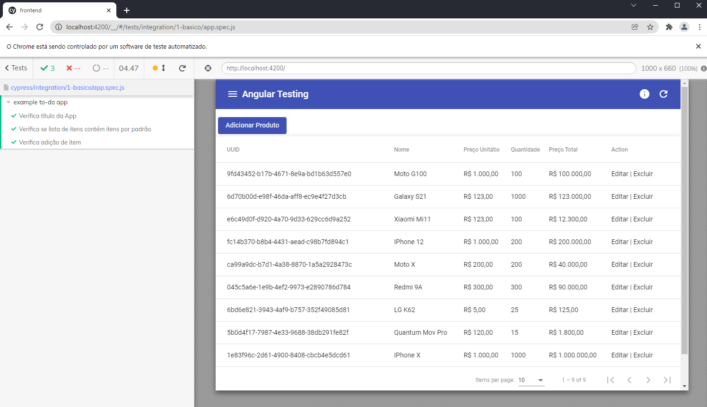
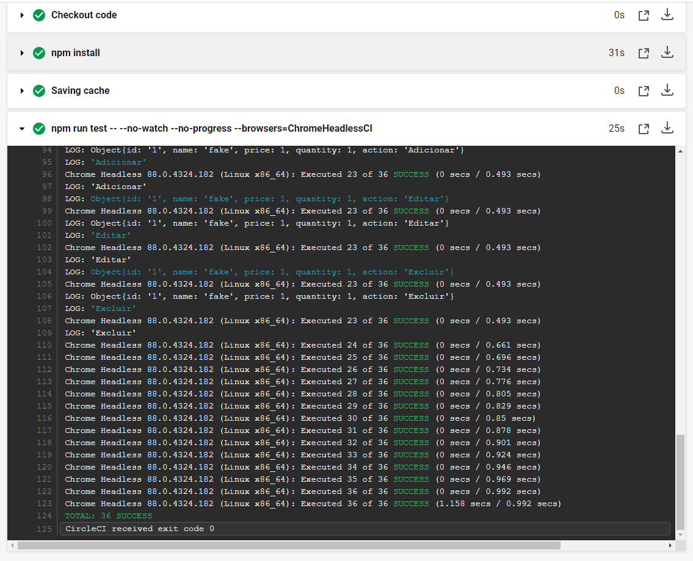
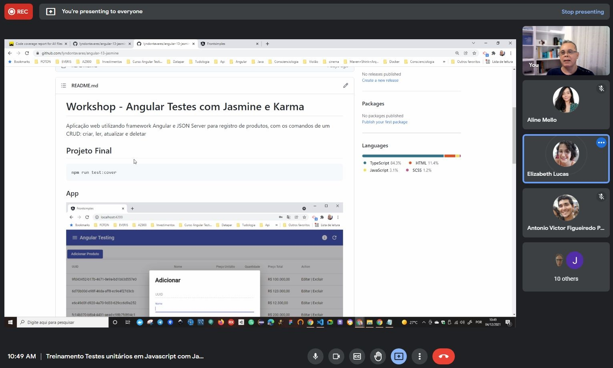

# Workshop - Angular Testes com Jasmine e Karma

[](https://badges.aleen42.com/src/angular.svg)
[](http://opensource.org/licenses/MIT)
[](https://circleci.com/gh/lyndontavares/angular-13-jasmine-cypress-circleci)

Aplicação desenvolvida no curso que ministrei, utilizando framework Angular e JSON Server para registro de produtos, com os comandos de um CRUD: criar, ler, atualizar e deletar

## Projeto Final

Instalção json-server

```bash
npm i -g json-server
```

Instalação App

```bash
cd frontend
npm i
```

Instalação Cypress

```bash
npm i cypress -D
ou
yarn add cypress --dev
```

Executar testes com Jasmine

```bash
npm run test:cover
```

Executar testes com Cypress

```bash
npm run server:json
ng serve

npx cypress run
ou
yarn cypress open
```

### App



### Tests


### Coverage


### Cypress



### CircleCi



### Workshop



## Github

https://github.com/lyndontavares/angular-13-jasmine-cypress
